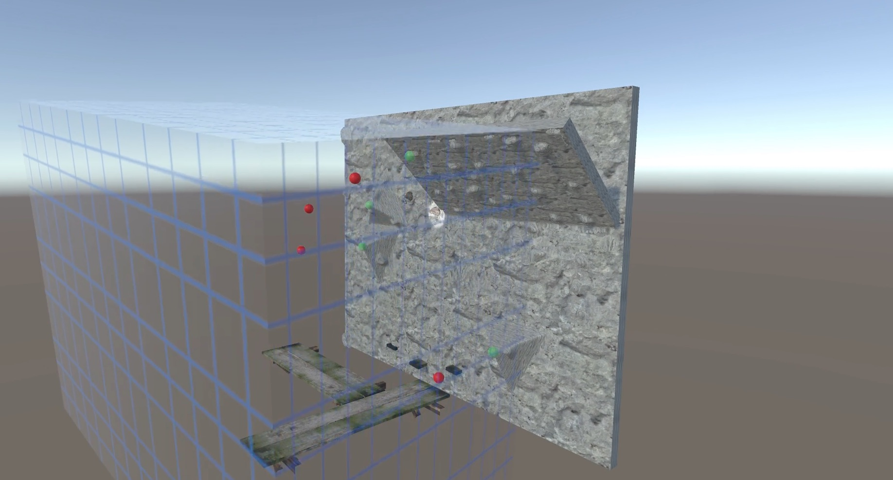

Virtual Reality to Actual Reality Mapping Plugin
================================================

Intro
----
For our virtual reality climbing prototype ([VR Climbing](https://www.youtube.com/watch?v=ock-jKru81o)), we needed a way to register a 3D model of a climbing wall to an actual physcial climbing wall. The basic idea is to define 3 or more points that are easily perceived on both the virtual representation and the actual physical climbing wall. 

This repository includes a demo scene of the climbing wall and the necessary scripts that enable you to use this calibration method also for other contexts, e.g. to calibrate a model of a room to the actual environment.

Prerequisites
-------------
* Unity with a HTC Vive HMD
* a correctly scaled 3D model of the room or object you want to calibrate in the virtual environment (we used a Kinect v1 and [Skanect](http://skanect.occipital.com/) for that)
* 3 or more points that can be easily perceived on both the model as also the actual physical object

Usage
-----

