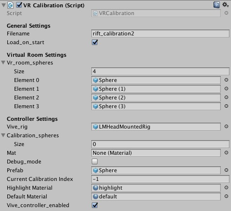
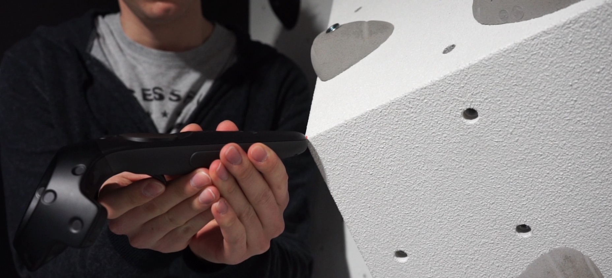

# Virtual Reality to Reality Calibration Unity Example

## Intro

For our virtual reality climbing prototype ([VR Climbing](https://www.youtube.com/watch?v=ock-jKru81o)), we needed a way to register a 3D model of a climbing wall to an actual physcial climbing wall. The basic idea is to define 3 or more points that are easily perceived on both the virtual representation and the actual physical climbing wall. 

This repository includes a demo scene of the climbing wall and the necessary scripts that enable you to use this calibration method also for other contexts, e.g. to calibrate a model of a room to the actual environment.

### Credits
The algorithm used in this project is based on the excelenct article by [Nghia Ho](http://nghiaho.com/?page_id=671)

### Disclaimer
This project is by no means perfect nor complete. Feel free to modify or improve the code by your liking, we appreaciate pull-requests.

## Prerequisites
* Unity with a HTC Vive HMD
* a correctly scaled 3D model of the room or object you want to calibrate in the virtual environment (**VE**) (we used a Kinect v1 and [Skanect](http://skanect.occipital.com/) for that)
* 3 or more points that can be easily perceived on both the model as also the actual physical object

## Components of the sample scene

In the Unity Project you will find a scene called *CalibrationExample*. This scene contains, among other things, the following Game Objects.

1. RoomRig
2. LMHeadMountedRig
3. Logic/RiftCalibration

### RoomRig
The RoomRig is basically a container of the room, object, or whatever you want to be the fixed point in your VE. It should also contain 3+ of fixed points. We used speheres but you could also use empty game objects. 

### LMHeadMountedRig
This game object contains the VR rig including the Leap Motion components. Furthermore, and this is essential for the later calibration procedure, each of the Controllers includes a Sphere object which is linked to the *Controller Model* field in *Vive Controller Calibration* script which is attached for both controllers. The sphere is positioned so that it exactly matches the socket for charging the controller. This is also the point that you would aim with the controller to your calibration points. When pressing the trigger on the controller, the position of socket is send to the calibration script. There is probably a more elegant solution for that...

In addition to that, the *Vive Controller Calibration* also has a field which points to the *RiftCalibration* game object.

### RiftCalibration
 
This game object holds the actual calibration script *VR Calibration*. In the following each of the fields is described:

* **Filename** The position of the calibration points that are created during manual calibration can be stored in a file using the context menu when right-clicking on the script component. 
* **Load_on_start** Check this box if you want the calibration file to be loaded upon start
* **Vr_room_sphers** These are the positions used for calibrations. Please make sure that you use the same order when tracing the positions with the vive controller.
* **Vive rig** This is usually linked to *LMHeadMountedRig*
* **Calibration Spheres** This is usually filled by pressing the trigger on the vive controller or by loading the spehers on startup (see *Load_on_start*).
* **Mat** *deprecated*
* **Debug Mode** When checked all calibration points including their centeroids are rendered.
* **Current Calibration Index** The index of the current calibration spehere. Increases when pressing the lever.
* **Highlight Material / Default Material** used to differentiate the current point to be traced from all other points.
* **Vive controller enabled** Usually, each press on the trigger of the controller adds a new calibration point. This was not a problem for our climbing example, but you might want to disable this after successful calibration.

### Usage of the sample scene
The sample scene should just be a reference for your own project since it does not make a lot of sense to calibrate something against the climbing wall. However, you can still play around a little bit.
 
## Your own environment
In the following we explain how to create a 3D model of your desk which can then be loaded into Unity and later calibrated with the Vive System.

### Creation of the 3D model
Create a 3D model of your desk. We used Skanect for this and got pretty good results. There may be other approaches but be sure that the model should be correctly scaled (which is the case when using Skanect).

### Select calibration points
In theory you just need 3 calibration points, but we found that using 3+ points is more robust. For example you could use 3 corners of your desk and one corner of your computer screen. 
After loading your 3D model into Unity create 4 Game Object and place their center on each of the 4 points you selected. Link the game objects to the *VR Calibration* script in *Vr_room_spheres*. **Important** rember the order.

### Calibrate the Vive space
 

Make sure you setup your vive in standing/moving mode. Also be sure that *Vive_controller_enabled* is checked. Then by pointing the charging socket of your controller at the calibration point, press the trigger. A short vibration will indicate that the press was registered. **Important** Rember the order ;)
After that, the Vive Space should rotate and shift so that your VE matches the reality. This would be a good opportunity to save the calibration spheres using the context menu of the script.

## Known issues
* Whenever you unplug the vive, a recalibration is necessary.

